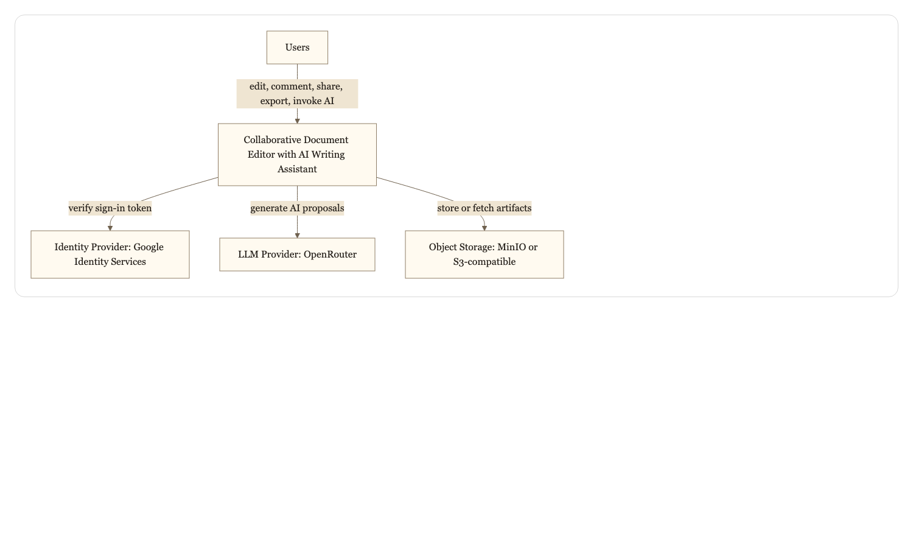
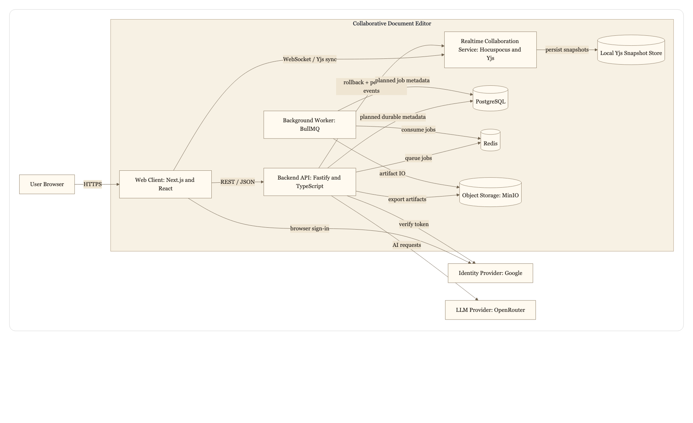
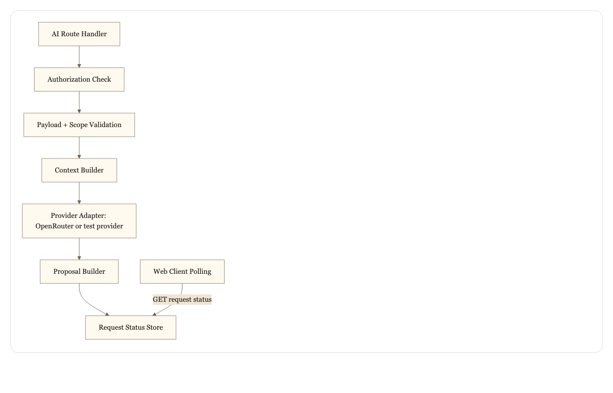
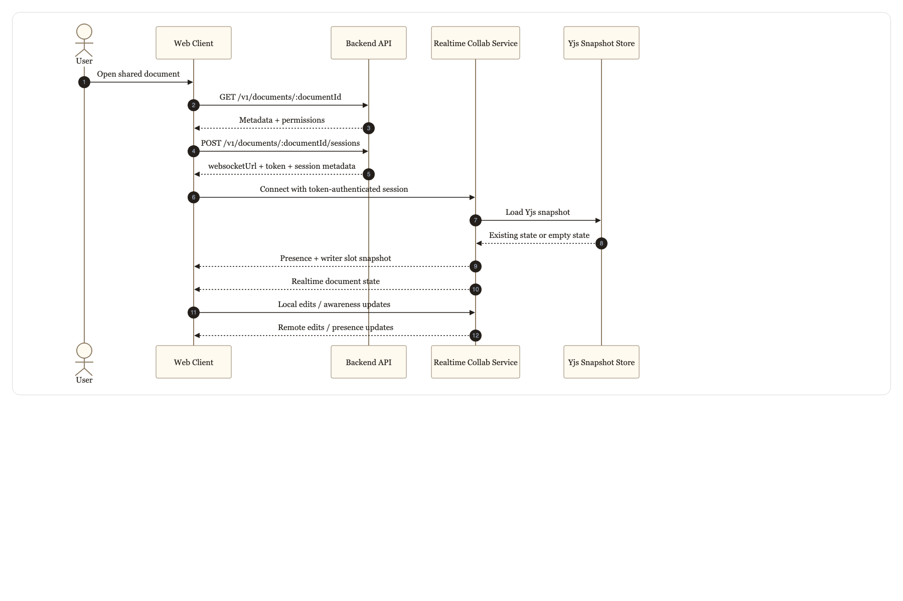
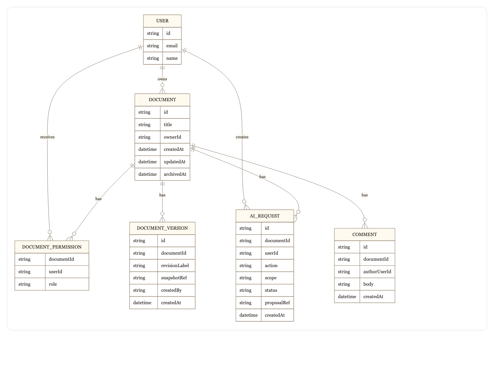

# AI1220 System Design Document

## Collaborative Document Editor with AI Writing Assistant

Version: 1.0  
Scope: AI1220 Assignment, System Architecture Deliverable  
Repository basis: current implementation in this repository as of April 3, 2026

## 1. Purpose

This document provides the architecture content required for the AI1220 assignment. It covers:

- architectural drivers
- C4 system context, container, and component views
- feature decomposition
- AI integration design
- API design
- authentication and authorization
- communication model
- code structure and repository organization
- data model
- architecture decision records

This version is intentionally aligned to the current repository implementation, not only to an ideal target architecture. Where the codebase is still using prototype persistence or local-development shortcuts, that is stated explicitly.

## 2. Architectural Drivers

| Rank | Driver | Why it matters |
|---|---|---|
| 1 | Reliable realtime collaboration | Concurrent editing is the core product behavior. If sessions do not converge, the product fails. |
| 2 | Safe AI assistance during collaboration | AI must produce reviewable proposals rather than silently overwriting newer human edits. |
| 3 | Correct permission enforcement | Owner, editor, commenter, and viewer behavior must remain distinct for editing, AI, export, and version restore. |
| 4 | Responsive user experience | Editing, reconnect, comments, and AI status need to feel fast enough for continuous use. |
| 5 | Realistic student-team implementation | The architecture must remain decomposable and testable in a monorepo without excessive operational overhead. |

These drivers lead to the main design choices:

- push-based collaboration via a dedicated realtime service
- AI returns proposals rather than direct document mutations
- business operations use REST, while live editing uses a persistent realtime channel
- metadata and collaborative state are separated

## 3. C4 Model

### 3.1 Level 1: System Context

Mermaid source: [ai1220-system-context.mmd](/Users/rayan.banerjee/courses/software%20project/docs/diagrams/ai1220-system-context.mmd)



The system interacts with users, an external identity provider for sign-in, an LLM provider for AI features, and object storage for export artifacts and future retained snapshots.

### 3.2 Level 2: Container Diagram

Mermaid source: [ai1220-container-view.mmd](/Users/rayan.banerjee/courses/software%20project/docs/diagrams/ai1220-container-view.mmd)



#### Container responsibilities

| Container | Responsibility | Technology choice |
|---|---|---|
| Web Client | Editor UI, document list, comments panel, AI actions, auth handoff, local draft recovery | Next.js, React, TypeScript |
| Backend API | Document CRUD, comments, sharing, versions, exports, AI orchestration, session bootstrap | Fastify, Node.js, TypeScript |
| Realtime Collaboration Service | Live editing sync, presence, reconnect behavior, writer slots, stateless collab events | Hocuspocus, Yjs, WebSocket |
| Background Worker | Async job execution for exports and future durable AI or revision work | BullMQ worker |
| PostgreSQL | Provisioned relational store for durable metadata | PostgreSQL |
| Redis | Queue coordination and transient worker state | Redis |
| Object Storage | Export artifacts and future retained snapshots | MinIO / S3-compatible storage |
| Local Yjs Snapshot Store | Current persisted realtime document content | Filesystem-backed `.bin` snapshots |

### 3.3 Level 3: Component Diagram for AI Service Path

The current repository does not run AI as a separate deployable service. Instead, the AI workflow is implemented as an API-side module with a provider adapter. The component-level design below reflects the actual code path.

Mermaid source: [ai1220-ai-component-view.mmd](/Users/rayan.banerjee/courses/software%20project/docs/diagrams/ai1220-ai-component-view.mmd)



The AI path:

- validates that the user has permission to invoke AI for the document
- validates operation type and scope
- constructs request context from the selected text and surrounding content
- calls the provider adapter
- stores request/proposal state
- returns a proposal that the user must explicitly accept or reject

## 4. Feature Decomposition

| Module | What it does | Depends on | Exposes |
|---|---|---|---|
| Editor frontend | Rich-text editing UI, selection, comments, AI actions, version UI | API, realtime collaboration service | User interactions and editor commands |
| Frontend state layer | Auth state, document state, comment state, reconnect status | Editor frontend, API | State selectors and actions |
| Realtime sync layer | Yjs updates, presence, reconnect, writer slots | Collaboration service | Session join, sync, presence updates |
| API layer | Documents, comments, sharing, versions, exports, AI requests | Auth, storage, worker, realtime service | REST endpoints |
| AI integration path | Proposal generation and lifecycle tracking | API, provider adapter | Request and status interfaces |
| Auth module | Sign-in, session validation, role checks | Identity provider, API | Session cookie and auth context |
| Storage/versioning module | Metadata and revision management | Postgres, object storage, local snapshots | Revision list, restore, export refs |

This decomposition keeps frontend interaction, REST business logic, realtime sync, and AI orchestration separated enough for team delivery and testing.

## 5. AI Integration Design

### 5.1 Context and Scope

The default AI context is the selected text plus limited surrounding context for coherence. Full-document scope should be reserved for summarization or structural operations because it costs more and increases latency.

Trade-offs:

- selection-only scope is faster and cheaper
- full-document scope is more accurate for global operations
- long documents should be constrained by operation-specific context rules

### 5.2 Suggestion UX

AI output is presented as a proposal in the right utility panel rather than directly editing the document.

- users can accept or reject proposals
- accepted changes remain part of the normal editor history
- proposals are linked to the original selection and request type
- AI actions are triggered from the editor context menu
- the UI polls request status until a proposal is ready

### 5.3 AI During Collaboration

The selected region is not locked while AI is running.

- the requester sees a pending or generating state
- other collaborators can continue editing
- if the source region changes, the proposal may become stale
- stale detection is tracked in the AI request lifecycle

### 5.4 Prompt Design

Prompt logic should remain template-based rather than being scattered across route handlers.

- operation-specific templates should exist for rewrite, summarize, translate, and restructure
- templates should accept structured input such as selected text, scope, and optional prompt
- prompt logic should remain isolated from HTTP transport logic

### 5.5 Model and Cost Strategy

Different models may be used for different tasks.

- lighter models can serve rewrite and formatting
- stronger models can serve summarize and restructure
- cost/latency controls should eventually include quotas or per-team limits
- when no real key is configured, normal runtime should fail honestly rather than silently mock

## 6. API Design

### 6.1 API Style

- REST is used for document CRUD, sharing, versions, exports, comments, and AI request submission
- a realtime push channel is used for collaborative editing and presence
- asynchronous job patterns are used for worker-oriented flows

This split keeps business operations explicit while preserving low-latency collaboration.

### 6.2 Core API Contract

#### Document CRUD

| Method | Endpoint | Purpose |
|---|---|---|
| POST | `/v1/documents` | Create document |
| GET | `/v1/documents` | List visible documents |
| GET | `/v1/documents/{id}` | Load metadata and permissions |
| PATCH | `/v1/documents/{id}` | Rename document |
| DELETE | `/v1/documents/{id}` | Archive document |

Example response:

```json
{
  "document": {
    "id": "doc_123",
    "title": "Design Notes",
    "createdAt": "2026-04-03T00:00:00.000Z",
    "updatedAt": "2026-04-03T00:00:00.000Z",
    "archivedAt": null,
    "permissions": {
      "role": "owner",
      "canView": true,
      "canComment": true,
      "canEdit": true,
      "canShare": true,
      "canExport": true,
      "canUseAi": true,
      "canRollback": true
    }
  }
}
```

#### Realtime session management

| Method | Endpoint | Purpose |
|---|---|---|
| POST | `/v1/documents/{id}/sessions` | Join an editing session and receive realtime credentials |

Example response:

```json
{
  "session": {
    "documentId": "doc_123",
    "joinedAt": "2026-04-03T00:00:00.000Z",
    "resumedFromSessionId": null,
    "self": {
      "sessionId": "sess_789",
      "documentId": "doc_123",
      "userId": "google:user_owner",
      "displayName": "Owner Demo",
      "role": "owner",
      "accessLevel": "write",
      "isPresent": true,
      "lastSeenAt": "2026-04-03T00:00:00.000Z",
      "connectionStatus": "active"
    },
    "collaborators": []
  },
  "websocketUrl": "ws://localhost:4001?documentName=doc_123&token=...",
  "token": "signed-session-token"
}
```

#### AI assistant invocation

| Method | Endpoint | Purpose |
|---|---|---|
| POST | `/v1/documents/{id}/ai/requests` | Submit AI operation |
| GET | `/v1/documents/{id}/ai/requests/{requestId}` | Poll request status |
| POST | `/v1/documents/{id}/ai/proposals/accept` | Accept proposal |
| POST | `/v1/documents/{id}/ai/proposals/reject` | Reject proposal |

Example request:

```json
{
  "action": "summarize",
  "prompt": null,
  "context": {
    "scope": "selection",
    "selectedText": "some selected content",
    "surroundingText": null
  },
  "maskPersonalData": false
}
```

Example status response:

```json
{
  "requestId": "air_456",
  "status": "running",
  "startedAt": "2026-04-03T00:00:00.000Z",
  "completedAt": null,
  "errorMessage": null,
  "proposal": null
}
```

#### Comments

| Method | Endpoint | Purpose |
|---|---|---|
| GET | `/v1/documents/{id}/comments` | List comments |
| POST | `/v1/documents/{id}/comments` | Create comment |

#### Sharing and permissions

| Method | Endpoint | Purpose |
|---|---|---|
| POST | `/v1/documents/{id}/invitations` | Create invitation |
| POST | `/v1/invitations/accept` | Accept invitation |
| PATCH | `/v1/documents/{id}/members/{userId}` | Update member role |
| DELETE | `/v1/documents/{id}/members/{userId}` | Revoke access |

### 6.3 Long-Running AI Operations

The client submits an AI request and then polls status until the request reaches a terminal state.

Possible status values include:

- `queued`
- `running`
- `succeeded`
- `failed`
- `cancelled`
- `stale`

### 6.4 Error Handling

Clients should distinguish common failure cases using the standard API error envelope.

| Case | API signal |
|---|---|
| AI still running | `200` with status `queued` or `running` |
| AI failed | `200` status payload with `failed`, or route-level provider/config error |
| Forbidden action | `403` |
| Document not found | `404` |
| Auth required | `401` |

## 7. Authentication and Authorization

Authentication identifies users, links actions to accounts, and enforces sharing rules.

Expected user types:

- document owners
- editors
- commenters
- viewers

### Roles and capabilities

| Role | Capabilities |
|---|---|
| Owner | Full control, including sharing, export, version restore, commenting, editing, and AI access |
| Editor | Read, edit, comment, invoke AI, view versions, and export |
| Commenter | Read and comment only |
| Viewer | Read only |

### Current implementation notes

- sign-in uses Google Identity Services in the browser
- the API validates Google ID tokens and issues signed session cookies
- the collab service authenticates realtime sessions using the signed token issued by the API
- local development currently auto-grants cross-account document access to simplify collaboration testing

Privacy considerations for third-party AI:

- selected content may leave the primary system boundary when sent to the LLM provider
- the minimum viable context should be sent
- request logs should avoid retaining unnecessary sensitive content

## 8. Communication Model

The system uses push-based realtime communication for editing sessions and standard request-response APIs for business operations.

### 8.1 Opening a Shared Document

Mermaid source: [ai1220-open-shared-document-sequence.mmd](/Users/rayan.banerjee/courses/software%20project/docs/diagrams/ai1220-open-shared-document-sequence.mmd)



### 8.2 Connectivity Loss and Recovery

If a user disconnects:

- local unsent edits are buffered in the browser
- the UI shows offline or reconnecting state
- when connectivity returns, the client rejoins the session
- the collab service reloads persisted Yjs state and resumes synchronization

### 8.3 Presence and Cursor Behavior

- connected collaborators can see presence updates in near real time
- writer slots distinguish active writers from queued or read-only sessions
- viewer sessions are represented in presence summaries but do not gain write capability
- presence entries are deduplicated by user to avoid duplicated viewer rows across reconnects

## 9. Code Structure and Repository Organization

### 9.1 Monorepo vs Multi-repo

A monorepo is the better fit for this project because frontend, backend, collab, worker, and shared contracts evolve together.

### 9.2 Current Repository Tree

```text
repo/
├── apps/
│   ├── web/
│   ├── api/
│   ├── collab/
│   └── worker/
├── packages/
│   ├── authz/
│   ├── editor-schema/
│   ├── shared-types/
│   ├── test-fixtures/
│   └── ui/
├── docs/
│   ├── adr/
│   ├── api/
│   ├── diagrams/
│   ├── process/
│   ├── specs/
│   └── tasks/
├── infrastructure/
│   ├── docker/
│   └── scripts/
├── tests/
└── README.md
```

### 9.3 Shared Code

Shared contracts and editor definitions live in workspace packages so both frontend and backend can import them without duplicating request/response logic.

### 9.4 Configuration Management

- secrets live in app-specific `.env.local` files
- `.env.example` files remain templates only
- Google/OpenRouter credentials should not be committed

### 9.5 Testing Structure

- API unit/integration tests live under `apps/api/tests`
- collab tests live under `apps/collab/tests`
- web tests live under `apps/web/tests`
- root tests validate cross-repo foundation behavior

## 10. Data Model

### 10.1 Storage Approach

Current persistence is hybrid:

- document metadata: API in-memory store
- comments: API in-memory store
- realtime document content: persisted Yjs snapshots on local disk
- queue coordination: Redis
- relational storage: Postgres provisioned but not yet the primary store for all runtime entities

Each document requires more than raw content:

- title
- owner and memberships
- timestamps
- archived status
- current collaborative state
- version and AI proposal references

### 10.2 Entity Relationship Diagram

Mermaid source: [ai1220-entity-relationship.mmd](/Users/rayan.banerjee/courses/software%20project/docs/diagrams/ai1220-entity-relationship.mmd)



### 10.3 Versioning, Permissions, and AI History

- version history allows owners and editors to inspect and restore prior document states
- permissions are modeled separately so documents can be shared across multiple users
- AI requests record operation type, scope, status, and proposal lifecycle

## 11. Architecture Decision Records

The repository already contains a broader ADR set under [docs/adr](/Users/rayan.banerjee/courses/software%20project/docs/adr). For the assignment, the four core ADRs are summarized here in the expected format.

### ADR-1: Use a CRDT-based collaboration model

Status: Accepted

Context: Multiple users need to edit the same document concurrently, including after temporary disconnects.

Decision: Use a Yjs/Hocuspocus-based realtime synchronization service with persisted Yjs snapshots.

Consequences:

- strong support for concurrent editing and reconnect behavior
- higher implementation complexity than a save-based editor

Alternatives considered:

- document locking, rejected because it harms collaboration
- last-write-wins, rejected because it risks silent data loss

### ADR-2: AI returns proposals, not direct edits

Status: Accepted

Context: AI responses can arrive after the underlying document selection has changed.

Decision: AI responses are shown as reviewable proposals that users explicitly accept or reject.

Consequences:

- safer collaboration and clearer user control
- extra UI work for proposal review

Alternatives considered:

- direct inline replacement, rejected because it can overwrite newer edits

### ADR-3: Use REST for business APIs and push-based sync for collaboration

Status: Accepted

Context: CRUD operations and realtime editing have different communication needs.

Decision: Use REST for standard business operations and a persistent realtime channel for collaborative editing.

Consequences:

- clear API boundaries
- two communication patterns instead of one

Alternatives considered:

- all polling, rejected because it harms collaboration UX
- all traffic through one custom socket protocol, rejected because it complicates standard API work

### ADR-4: Use a monorepo with shared contracts

Status: Accepted

Context: Frontend, backend, worker, and collab contracts evolve together.

Decision: Keep project code in one repository with shared packages for types, auth rules, UI primitives, and editor schema.

Consequences:

- simpler coordination for a student team
- requires discipline to keep module boundaries clean

Alternatives considered:

- separate repositories, rejected because it adds overhead too early

## 12. Conclusion

This architecture is no longer just a conceptual target. The current repository already implements the main structural choices: a monorepo, REST business APIs, a dedicated realtime collaboration service, proposal-based AI, and shared contract packages. The main remaining work is to replace prototype persistence and local-development shortcuts with durable production-grade storage and deployment behavior.
