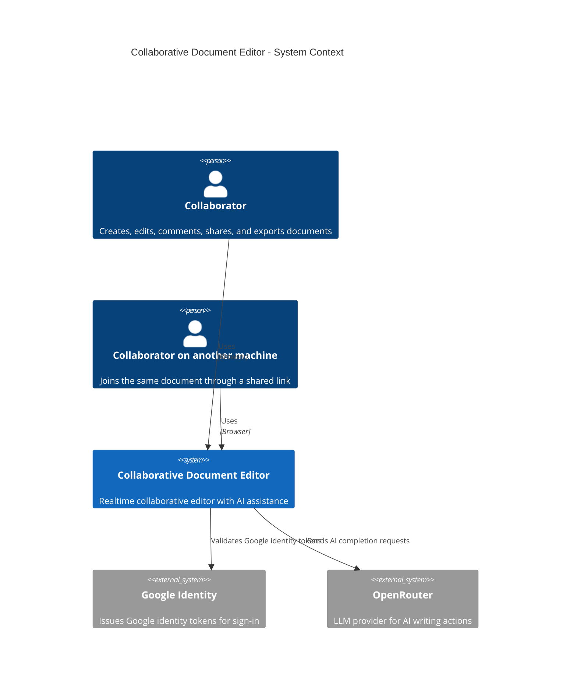
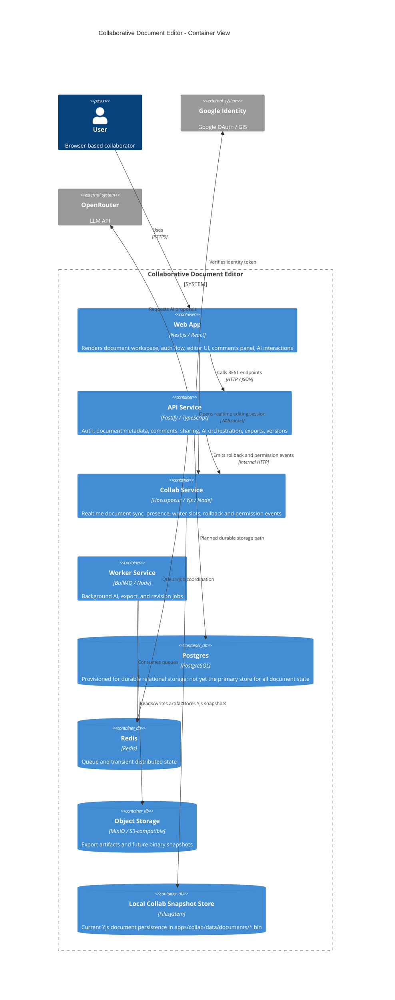
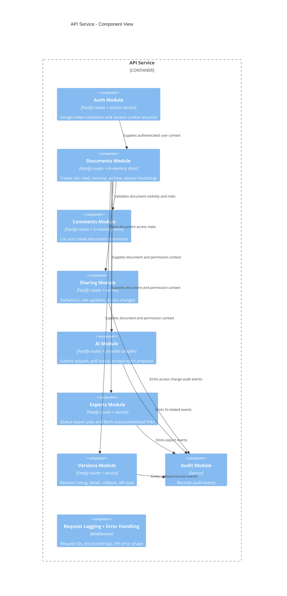
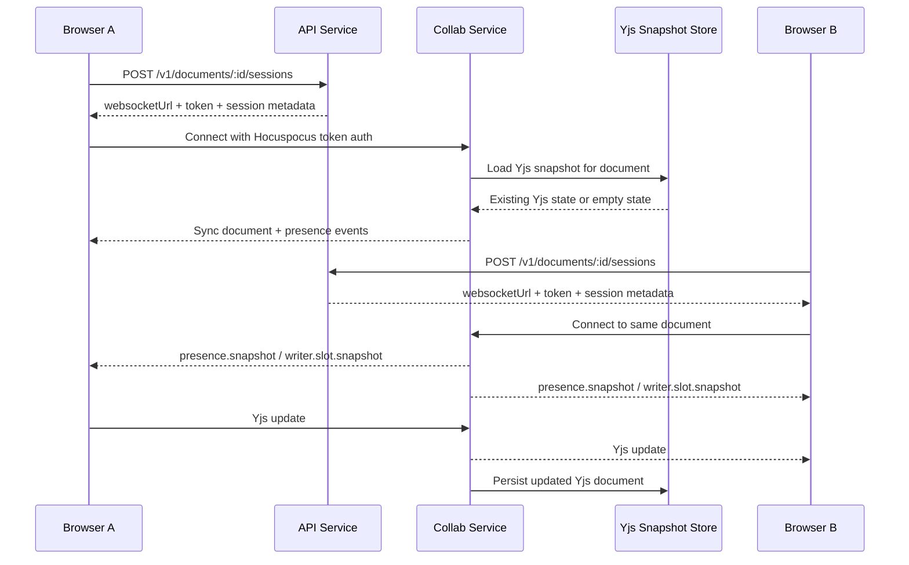

# Collaborative Document Editor

Updated system design document for the current repository state.

This document supersedes the stale root PDF, [system_design_document (1).pdf](/Users/rayan.banerjee/courses/software%20project/system_design_document%20%281%29.pdf). The PDF appears to reflect an earlier concept stage. This markdown version is aligned to the code currently in the repo as of April 3, 2026.

## 1. Purpose

The product is a collaborative document editor with:

- browser-based editing
- realtime collaboration and presence
- document sharing and role-based access
- AI-assisted writing actions
- export and versioning surfaces

The current codebase is a working local prototype with real service boundaries and realtime infrastructure, but not all persistence paths are production-grade yet.

## 2. Current Status

### Implemented

- `apps/web` is a real Next.js client
- `apps/api` is a real Fastify API
- `apps/collab` is a Hocuspocus/Yjs collaboration service
- `apps/worker` is a BullMQ-based worker runtime
- Google sign-in is wired through the web client and API session issuance
- OpenRouter-backed AI is supported when a real key is present
- document create, rename, delete, comments, sharing, versioning, and export routes exist
- realtime session auth, presence, reconnect handling, writer slots, and Yjs document persistence are implemented

### Not fully production-ready yet

- document metadata is still stored in API memory
- comments are still stored in API memory
- worker/export flows are scaffolded more than fully operational
- version diffing is still stubbed
- several persistence paths still need migration to durable storage
- development mode currently auto-grants document visibility/access across accounts for easier local testing

## 3. Architectural Overview

### Core idea

The system is split into four application layers:

1. `web` for user interaction
2. `api` for document metadata, auth, AI orchestration, comments, exports, and permissions
3. `collab` for realtime Yjs document sync and collaborative presence
4. `worker` for background jobs

Infrastructure services provide Postgres, Redis, and MinIO for local development.

## 4. C4 Context Diagram

## 5. C4 Container Diagram

## 6. C4 Component Diagram: API Service

## 7. Request and Data Flows

### 7.1 Sign-in flow

1. User opens `/auth` in the web app.
2. Google Identity Services issues an ID token in the browser.
3. Web app posts the token to `POST /v1/auth/callback`.
4. API validates the token against Google.
5. API issues a signed session cookie.
6. Subsequent web requests use that cookie for authenticated API and collab session bootstrap calls.

### 7.2 Document creation flow

1. User clicks `New document` in the documents page.
2. Web app calls `POST /v1/documents`.
3. API creates a new in-memory document record and assigns owner role.
4. Web app navigates to `/documents/:documentId`.

### 7.3 Realtime editing flow

### 7.4 Comments flow

1. User types into the comment composer below the editor.
2. Web app calls `POST /v1/documents/:id/comments`.
3. API validates access and stores the comment in the in-memory comment store.
4. Web app refreshes the right-side comments panel.

### 7.5 AI proposal flow

1. User selects text and invokes AI from the editor context menu.
2. Web app submits `POST /v1/documents/:id/ai/requests`.
3. API sends the request to OpenRouter when configured.
4. Web app polls request status.
5. When a proposal is ready, the user can apply or reject it.

## 8. Data Ownership and Persistence

### Current persistence layout

| Concern | Current storage |
|---|---|
| Auth session | Signed cookie issued by API |
| Document metadata | API process memory |
| Comments | API process memory |
| Realtime editor content | Collab filesystem snapshots (`apps/collab/data/documents/*.bin`) |
| Browser draft recovery | IndexedDB + local storage |
| Queue infrastructure | Redis |
| Durable relational store | Postgres provisioned, not yet primary for all features |
| Binary/artifact store | MinIO provisioned |

### Implications

- restarting the API currently loses document metadata and comments
- restarting the collab service does not necessarily lose editor content because Yjs snapshots are persisted to disk
- local browser draft recovery can repopulate content when the collab document is temporarily empty

## 9. Security Model

### Identity

- browser sign-in uses Google Identity Services
- API validates Google ID tokens
- API issues signed application sessions

### Authorization

Document roles:

- `owner`
- `editor`
- `commenter`
- `viewer`

Role-derived permissions are enforced centrally for:

- view
- comment
- edit
- share
- export
- AI use
- rollback

### Important current caveat

In non-production runtime, the API currently auto-grants cross-account editor visibility/access to simplify local collaboration testing. That is a development convenience, not the intended production sharing model.

## 10. Realtime Collaboration Design

The collab service is responsible for:

- authenticating Hocuspocus connections
- associating each connection with a signed user session
- loading and storing Yjs state
- broadcasting presence snapshots
- managing writer slot allocation and queueing
- broadcasting permission updates and rollback events

Current status:

- presence is real
- reconnect handling is real
- writer slot state is real
- Yjs document content sync is real
- persisted snapshots are local filesystem based, not object-storage backed yet

## 11. Comments, Versions, Exports, and AI

### Comments

- basic document comments now exist
- currently in-memory
- exposed via REST and rendered in the web utility panel

### Versions

- revision list/detail/rollback endpoints exist
- diff endpoint is still a stub

### Exports

- export request/status/download routes exist
- storage/rendering path is still partially scaffolded

### AI

- AI request lifecycle exists end to end
- OpenRouter integration is available
- a missing key now fails honestly instead of silently mocking in normal runtime

## 12. Known Gaps

The biggest remaining architectural gaps are:

1. move document metadata and comments from in-memory stores to Postgres
2. move collab snapshot persistence from local disk to a durable shared store
3. complete export rendering and artifact lifecycle
4. replace version diff stub with a real diff implementation
5. tighten multi-machine deployment with stable public URLs, cookie domain rules, and HTTPS/WSS defaults
6. remove the dev-only auto-access shortcut once the full sharing flow becomes the standard collaboration path

## 13. Recommended Next Architecture Steps

### Short term

- migrate `DocumentsService` to Postgres-backed storage
- migrate `CommentsService` to Postgres-backed storage
- add a real document query path shared by web/API/collab
- persist AI request/proposal history durably

### Medium term

- move collab snapshots into S3-compatible object storage or database-backed Yjs persistence
- connect worker-based export rendering to MinIO
- implement durable audit storage

### Production hardening

- front services behind proper HTTPS/WSS endpoints
- lock down CORS and cookie configuration per environment
- remove local-development cross-account shortcuts
- add browser-level E2E coverage for multi-user collaboration flows

## 14. Implementation Mapping

Primary files for the current design:

- web shell and editor:
  - [apps/web/src/components/documents/document-workspace-shell.tsx](/Users/rayan.banerjee/courses/software%20project/apps/web/src/components/documents/document-workspace-shell.tsx)
  - [apps/web/src/editor/base-editor.tsx](/Users/rayan.banerjee/courses/software%20project/apps/web/src/editor/base-editor.tsx)
- API bootstrap:
  - [apps/api/src/app.ts](/Users/rayan.banerjee/courses/software%20project/apps/api/src/app.ts)
- documents:
  - [apps/api/src/modules/documents/service.ts](/Users/rayan.banerjee/courses/software%20project/apps/api/src/modules/documents/service.ts)
  - [apps/api/src/modules/documents/index.ts](/Users/rayan.banerjee/courses/software%20project/apps/api/src/modules/documents/index.ts)
- comments:
  - [apps/api/src/modules/comments/service.ts](/Users/rayan.banerjee/courses/software%20project/apps/api/src/modules/comments/service.ts)
  - [apps/api/src/modules/comments/index.ts](/Users/rayan.banerjee/courses/software%20project/apps/api/src/modules/comments/index.ts)
- collaboration:
  - [apps/collab/src/server.ts](/Users/rayan.banerjee/courses/software%20project/apps/collab/src/server.ts)
- worker:
  - [apps/worker/src/worker/runtime.ts](/Users/rayan.banerjee/courses/software%20project/apps/worker/src/worker/runtime.ts)
- local deployment:
  - [infrastructure/docker/docker-compose.yml](/Users/rayan.banerjee/courses/software%20project/infrastructure/docker/docker-compose.yml)

## 15. Summary

The repository is no longer just a scaffold. It now has real application boundaries, realtime sync, authenticated collaboration, AI integration, and a working local multi-service runtime. The major remaining work is not about deciding the architecture anymore; it is about replacing prototype persistence and dev shortcuts with durable production-grade implementations.
